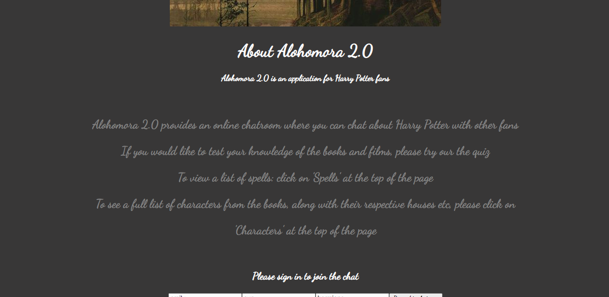

# Alohomora 2.0

### An application for Harry Potter fans

Deployed (temporarily) at the following: https://5f88db6e46264f4cec7743c1--thirsty-johnson-2e67ef.netlify.app

Alohomora 2.0 features a chat-room, a quiz, and pages with spells and characters (which have been pulled from the Unofficial Harry Potter API)

### User Stories

```
As a Harry Potter fan
So I can test my knowledge of the books and films
I’d like to be able to take part in a quiz

As a Harry Potter fan
So I can see how good I really am
I want to be able to see my score at the end of the quiz

As a Harry Potter fan
Who wants to talk to others about Harry Potter
I want to be able to post messages in a chatroom

As a Harry Potter fan
Who wants to share my passion for Harry Potter with others
I want to be able to enter a username

As a Harry Potter fan
Who for some reason can’t always remember the names of all of the spells in Harry Potter
I want to be able to see a list of spells

As a Harry Potter fan
Who also can’t remember the names of all of the characters
I want to be able to see a list of characters
```

# How to run:
* Clone the repo:
```
git clone https://github.com/emilyjspencer/Alohomora--2.0.git
```
* Cd into the repo
* Cd into the client folder
* Install the dependencies with the following command:
```
npm install
```
* Cd into the server folder
* Install the dependencies with the following command:
```
npm install
```
* Start the server with:
```
node app.js
```
* Open a second terminal
* Cd into the client folder
* Start the server with:
```
npm start
```
* A browser window should open at localhost:3000

### What is (currently looks like)

Homepage:

Homepage:

Spells:

Quiz:

Quiz:

Chat:

Main page:

Sign in:

Characters (zoomed out):
